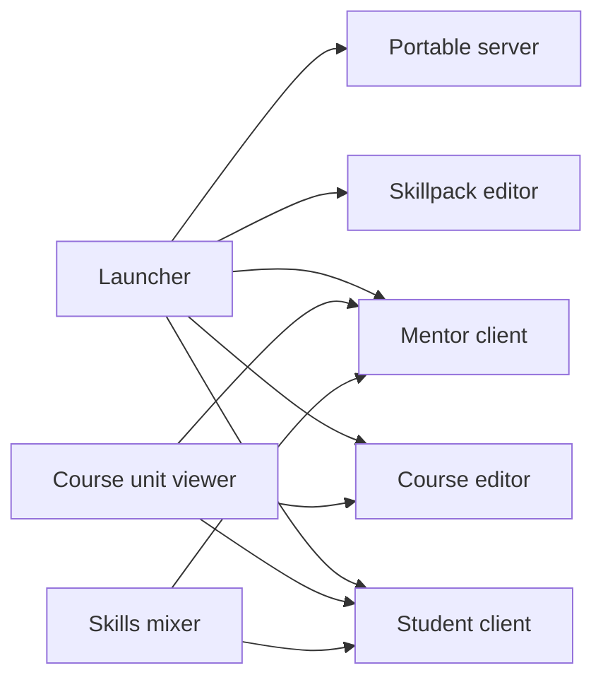

# Diploma graph

```mermaid
graph LR

N1[Launcher];

N2[Skillpack editor];
N3[Course editor];
N4[Student client];
N5[Mentor client];
N6[Portable server];

N1 --> N2;
N1 --> N3;
N1 --> N4;
N1 --> N5;
N1 --> N6;

N7[Course unit viewer];
N8[Skills mixer];

N7 --> N3;
N7 --> N4;
N7 --> N5;

N8 --> N4;
N8 --> N5;

```
