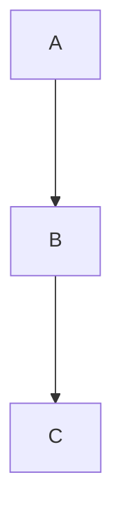

# Семинар 4

*Generics*

* raw type - обобщенный тип без указания параметра типа
* как было до появления generics:

```java
public long getSum(List accounts) {
   long sum = 0;

   for (int i = 0, n = accounts.size(); i < n; i++) {
       Object account = accounts.get(i);
       if (account instanceof Account) {
           sum += ((Account) account).getAmount();
       }
   }

   return sum;
}
```

* как стало после их появления:

```java
public long getSum2(List<Account> accounts) {
   long sum = 0;

   for (Account account : accounts) {
       sum += account.getAmount();
   }

   return sum;
}
```

* Ковариантность — это сохранение иерархии наследования исходных типов в производных типах в том же порядке. Пример: ```Множество<Животные> = Множество<Кошки>```
* Контравариантность — это обращение иерархии исходных типов на противоположную в производных типах. Пример: ```Множество<Кошки> = Множество<Животные>```
* Инвариантность — отсутствие наследования между производными типами. Пример: ```Множество<Животные> != Множество<Кошки> && Множество<Кошки> != Множество<Животные>```
* Массивы ковариантны. Пример: ```Animal[] array = (Animal[]) new Cat[10]```
* generics инвариантны. Пример: ```Если взять список целых чисел, то он не будет являться ни подтипом типа Number, ни каким-либо другим подтипом. Он является только подтипом самого себя.```
* wildcard ```?``` позволяет нарушать инвариантность generics
  * Ковариантность: ```ArrayList<? extends Animal> nums = new ArrayList<Cat>()```
  * Инвариантность: ```ArrayList<? super Cat> cats = new ArrayList<Animal>()```
* Пример:



```java
class A {}
class B extends A {}
class C extends B {}

ArrayList<? extends B> arrayList_ea = new ArrayList<A>(); // BAD
ArrayList<? extends B> arrayList_eb = new ArrayList<B>();
ArrayList<? extends B> arrayList_ec = new ArrayList<C>();

ArrayList<? super B> arrayList_sa = new ArrayList<A>();
ArrayList<? super B> arrayList_sb = new ArrayList<B>();
ArrayList<? super B> arrayList_sc = new ArrayList<C>(); // BAD
```

```java
  B[] array_a = new A[1]; // BAD
  B[] array_b = new B[1];
  B[] array_c = new C[1];
```


