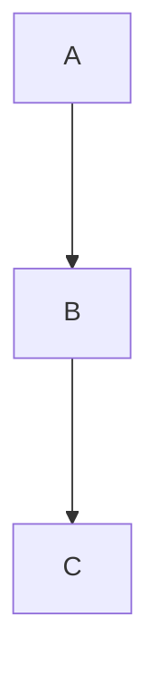

# Семинар 4

*Generics*

Заметки основаны на [этой статье](https://habr.com/ru/companies/sberbank/articles/416413/).

* raw type - обобщенный тип без указания параметра типа. Используя Raw типы, мы возвращаемся в эру до дженериков и сознательно отказываемся от всех фич, присущих параметризованным типам - в новых версиях будет warning unchecked.
* generics работает только на этапе компиляции. В runtime все типы будут Object.
* как было до появления generics:

```java
public long getSum(List accounts) {
   long sum = 0;

   for (int i = 0, n = accounts.size(); i < n; i++) {
       Object account = accounts.get(i);
       if (account instanceof Account) {
           sum += ((Account) account).getAmount();
       }
   }

   return sum;
}
```

* как стало после их появления:

```java
public long getSum2(List<Account> accounts) {
   long sum = 0;

   for (Account account : accounts) {
       sum += account.getAmount();
   }

   return sum;
}
```

* Переменные типа: идентификатор типа в угловых скобках при объявлении класса или метода ```<T>```. Можно использовать в качестве типа. Можно использовать extends: ```<T extends A>```.
   * recursive bound - переменная типа зависит сама от себя ```class A <T extends A<T>>```. В этом случае, класс-родитель может получить тип класса наследника, потому что класс наследник будет писать: ```class B extends A<B>```.
   * Multiple bounds - можно указывать еще и интерфейс: ```class A <T extends Integer & Comparable>```


* Ковариантность — это сохранение иерархии наследования исходных типов в производных типах в том же порядке. Пример: ```Множество<Животные> = Множество<Кошки>```
* Контравариантность — это обращение иерархии исходных типов на противоположную в производных типах. Пример: ```Множество<Кошки> = Множество<Животные>```
* Инвариантность — отсутствие наследования между производными типами. Пример: ```Множество<Животные> != Множество<Кошки> && Множество<Кошки> != Множество<Животные>```
* Массивы ковариантны. Пример: ```Animal[] array = (Animal[]) new Cat[10]```
* generics инвариантны. Пример: ```Если взять список целых чисел, то он не будет являться ни подтипом типа Number, ни каким-либо другим подтипом. Он является только подтипом самого себя.```
* wildcard ```?``` позволяет нарушать инвариантность generics
  * Ковариантность: ```ArrayList<? extends Animal> nums = new ArrayList<Cat>()```
  * Инвариантность: ```ArrayList<? super Cat> cats = new ArrayList<Animal>()```
* Пример:



```java
class A {}
class B extends A {}
class C extends B {}

ArrayList<? extends B> arrayList_ea = new ArrayList<A>(); // BAD
ArrayList<? extends B> arrayList_eb = new ArrayList<B>();
ArrayList<? extends B> arrayList_ec = new ArrayList<C>();

ArrayList<? super B> arrayList_sa = new ArrayList<A>();
ArrayList<? super B> arrayList_sb = new ArrayList<B>();
ArrayList<? super B> arrayList_sc = new ArrayList<C>(); // BAD
```

```java
  B[] array_a = new A[1]; // BAD
  B[] array_b = new B[1];
  B[] array_c = new C[1];
```

* PECS = producer extends consumer super = extends только читает, super только пишет
   * extends: можно возвращать объект типа T, но передавать в параметр нельзя (исключение null). При использовании **extends**, говорят, что это ограничение **сверху**.
   * super: можно передавать объект типа T в параметр метода, но возвращать такой объект нельзя (исключение Object). При использовании **super**, говорят, что это ограничение **снизу**.

```java 
arrayList_eb.add(new Object()); // BAD
B eb = arrayList_eb.get(0);

arrayList_sb.add(new B());
B sb = arrayList_sb.get(0); // BAD
```

* Пример, зачем это нужно (функция из библиотеки):

```
public static <T> void copy(List<? super T> dest, List<? extends T> src) {
}
```

В данном случае логично, что копирование происходит из коллекции, где все элементы иерархически моложе, в коллекцию, где все элементы иерархически старше.

* Запись вида ```Collection<?>``` равносильна ```Collection<? extends Object>```. Поэтому обычный wildcard - это producer, то есть передавать в него объект типа T нельзя.
* Паттерн wildcard capture позволяет решить проблему:

```java
public static void reverse(List<?> list) { 
  rev(list); 
}

private static <T> void rev(List<T> list) {
  List<T> tmp = new ArrayList<T>(list);
  for (int i = 0; i < list.size(); i++) {
    list.set(i, tmp.get(list.size()-i-1));
  }
}
```


